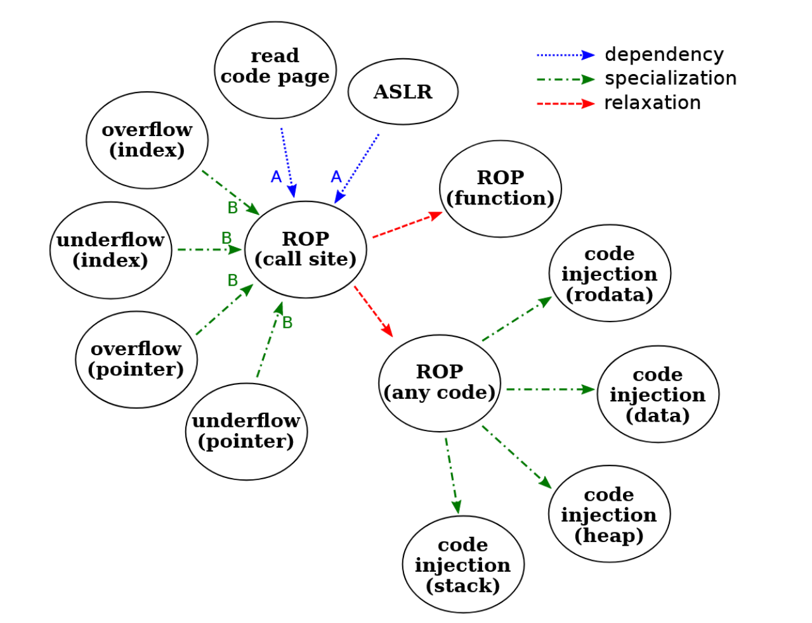

# The Internals of the test bench

## Summary of test cases

The initial test suite for memory safety currently contains 221 test cases covering spatial, temporal and type safety of memory, memory access control, pointer integrity and control-flow integrity. Each type of vulnerabilities and their related defenses have been individually evaluated by one or more test cases. 

### Spatial safety

Spatial safety refers to the property that memory accesses are always in compliance with the proper data boundaries and the scope of visibility defined by the program. Any access outside the boundary or the scope of visibility is considered insecure. It is violated by classic buffer overflow attacks, which is then used to smash the stack and alter the stored return address. Heap attacks also resort to buffer overflow to access/alter data across the object boundary. Currently, the test suite has 142 test cases to measure spatial safety.

#### Check padding between objects. 8 test cases in total.

- check-inter/intra-obj-data-redzone 
- check-inter/intra-obj-heap-redzone
- check-inter/intra-obj-rodata-redzone
- check-inter/intra-obj-stack-redzone

Check the padding between different objects or members, including padding between objects and padding between members within objects. If padding exists, the corresponding MSS test needs to increase the corresponding offset of padding. So the current type of testing belongs to out-of-boundary test cases' dependencies.

#### General read out-of-boundary. 24 test cases in total.
  
- read-by-bare/enclosing-array-pointer/index-overflow/underflow-data
- read-by-bare/enclosing-array-pointer/index-overflow/underflow-heap
- read-by-bare/enclosing-array-pointer/index-overflow/underflow-rodata
- read-by-bare/enclosing-array-pointer/index-overflow/underflow-stack

Both buffer overflow and underflow reads have been tested. We consider two potential ways to access data out-of-boundary: One is to access with a valid buffer pointer but an out-of-boundary offset (index) and the other one is to directly make a previously valid buffer pointer point to an out-of-boundary location (ptr). For defenses using memory tags or fat pointers, these two ways may result in exceptions being triggered at different locations depending on whether the pointer or the buffer memory is tagged. There are two types of target arrays where overflow occurs, one is the bare array, which means it is an independent array. Another type is the enclosing array, which means an array that is included in the structure. Since the defense mechanisms on stack, heap, global data and read-only data sections might be different, they are tested separately. These tests are the most general cases for out-of-boundary reads that read only the neighbors of the buffer (overflow by one) without going too far.

#### Read out-of-boundary by large index. 8 test cases in total.

- read-by-enclosing-array-pointer-large-count-overflow-data
- read-by-enclosing-array-pointer-large-count-overflow-heap
- read-by-enclosing-array-pointer-large-count-overflow-rodata
- read-by-enclosing-array-pointer-large-count-overflow-stack
- read-by-enclosing-array-pointer-large-count-underflow-data
- read-by-enclosing-array-pointer-large-count-underflow-heap
- read-by-enclosing-array-pointer-large-count-underflow-rodata
- read-by-enclosing-array-pointer-large-count-underflow-stack


The difference between these tests and the classic tests mentioned above is that the target array capacity overflowed by the current test is much larger than the capacity of a regular array. The possible impact on defense is that when hardware or software sets boundaries, it is impossible to accurately limit boundaries due to the need to compress too large capacity values


#### General write out-of-boundary. 12 test cases in total.

- write-by-bare/enclosing-array-pointer/index-overflow/underflow-data
- write-by-bare/enclosing-array-pointer/index-overflow/underflow-heap
- write-by-bare/enclosing-array-pointer/index-overflow/underflow-rodata
- write-by-bare/enclosing-array-pointer/index-overflow/underflow-stack

Similar to out-of-boundary read tests, these tests try to write out-of-boundary. Both buffer overflow and underflow writes have been tested. Both index and pointer ways of accesses have been considered. Buffers on stack, heap and global data sections have been tested separately.

#### Access cross the object boundary. 20 test cases in total.

- read-cross-object-index-stack
- read-cross-object-index-heap
- read-cross-object-index-data
- read-cross-object-index-rodata
- read-cross-object-ptr-stack
- read-cross-object-ptr-heap
- read-cross-object-ptr-data
- read-cross-object-ptr-rodata
- write-cross-object-index-overflow-stack
- write-cross-object-index-overflow-heap
- write-cross-object-index-overflow-data
- write-cross-object-ptr-overflow-stack
- write-cross-object-ptr-overflow-heap
- write-cross-object-ptr-overflow-data
- write-cross-object-index-underflow-stack
- write-cross-object-index-underflow-heap
- write-cross-object-index-underflow-data
- write-cross-object-ptr-underflow-stack
- write-cross-object-ptr-underflow-heap
- write-cross-object-ptr-underflow-data

All tests are special cases of the general read out-of-boundary and the general write out-of-boundary cases. Some defenses may choose to put invalid data between objects as a tripwire or enforce the boundary check at the granularity of objects. In these cases, the general overflow vulnerabilities exist but the more severe form of them, accessing crossing the object boundary, is disabled. To check these types of vulnerabilities, the test suite tests both read and write accesses, both index and pointer ways of accessing, and objects on stack, heap, global data and read-only data.

#### Access cross the stack frame. 4 test cases in total.

- read-cross-frame-index
- read-cross-frame-ptr
- write-cross-frame-index
- write-cross-frame-ptr

All tests are special cases of the general read out-of-boundary and the general write out-of-boundary cases. To thwart overflow attacks against variables over the frame boundary, some defenses choose to put padding bytes between the frames while some other defenses use fat-pointers to enforce data integrity at the frame granularity. Data compartmentalization at the frame granularity is also effective. The test suite tests both read and write accesses across the frame boundary using indices or pointers.

#### Access cross pages. 4 test cases in total.

- read-cross-page-index 
- read-cross-page-ptr 
- write-cross-page-index 
- write-cross-page-ptr

All tests are special cases of the access cross the stack frame cases. Page table attributes have long been used to enforce access permissions. System software or memory allocation library may use the page accessing property to partially thwart overflow attacks. Since pages are normally larger than stack frames, we consider these as special cases of access cross the stack frame. The test suite tests both read and write access cross the page boundary using indices or pointers.

#### Access cross sections. 36 test cases in total.

- read-cross-section-stack-to-heap-index 
- read-cross-section-stack-to-data-index 
- read-cross-section-stack-to-rodata-index 
- read-cross-section-heap-to-stack-index 
- read-cross-section-heap-to-data-index 
- read-cross-section-heap-to-rodata-index 
- read-cross-section-data-to-stack-index 
- read-cross-section-data-to-heap-index 
- read-cross-section-data-to-rodata-index 
- read-cross-section-rodata-to-stack-index 
- read-cross-section-rodata-to-heap-index 
- read-cross-section-rodata-to-data-index 
- read-cross-section-stack-to-heap-ptr 
- read-cross-section-stack-to-data-ptr 
- read-cross-section-stack-to-rodata-ptr 
- read-cross-section-heap-to-stack-ptr 
- read-cross-section-heap-to-data-ptr 
- read-cross-section-heap-to-rodata-ptr 
- read-cross-section-data-to-stack-ptr 
- read-cross-section-data-to-heap-ptr 
- read-cross-section-data-to-rodata-ptr 
- read-cross-section-rodata-to-stack-ptr 
- read-cross-section-rodata-to-heap-ptr 
- read-cross-section-rodata-to-data-ptr 
- write-cross-section-stack-to-heap-index 
- write-cross-section-stack-to-data-index 
- write-cross-section-heap-to-stack-index 
- write-cross-section-heap-to-data-index 
- write-cross-section-data-to-stack-index 
- write-cross-section-data-to-heap-index 
- write-cross-section-stack-to-heap-ptr 
- write-cross-section-stack-to-data-ptr 
- write-cross-section-heap-to-stack-ptr 
- write-cross-section-heap-to-data-ptr 
- write-cross-section-data-to-stack-ptr 
- write-cross-section-data-to-heap-ptr

All tests are special cases of the general read out-of-boundary and the general write out-of-boundary cases. Attackers can manipulate the stack data using a heap pointer and probably vice versa. To test these special attack variants, the test suite checks all possible scenarios for accessing cross section boundaries.

#### Overflow generated through type conversion. 8 test cases in total.

- read-scalar-cast-to-array-overflow-data
- read-scalar-cast-to-array-overflow-heap
- read-scalar-cast-to-array-overflow-rodata
- read-scalar-cast-to-array-overflow-stack
- read-scalar-cast-to-scalar-overflow-data
- read-scalar-cast-to-scalar-overflow-heap
- read-scalar-cast-to-scalar-overflow-rodata
- read-scalar-cast-to-scalar-overflow-stack

The tests encompass two distinct types of type conversion methods: scalar to scalar conversion and scalar to array conversion. Overflow occurs when data types with smaller memory requirements are converted into data types with larger memory requirements.

#### Spray attack. 6 test cases in total.

- spray-cross-object-stack
- spray-cross-object-heap
- spray-cross-object-data
- spray-cross-frame
- spray-cross-page-stack
- spray-cross-page-heap

All tests are special cases of the general write out-of-boundary cases. In the access tests, out-of-boundary data are directly accessed using indices or pointers and leave all the data in between untouched. While in spray tests, all the data between the buffer to the out-of-boundary target are rewritten. Such behavior is more likely to be detected by memory padding and tagging than a direct out-of-boundary access. The test suite currently tests six spray attacks: spray cross the object boundary on stack, heap and global data, spray cross stack frames, and spray cross pages on stack and heap.   

### Temporal Safety

Temporal safety pertains to the characteristic that data accessed in memory occurs exclusively throughout the lifespan of the data. Any access prior to initialization or subsequent to deallocation is deemed insecure. These vulnerabilities have the potential to result in memory corruption, return-to-libc attacks, and arbitrary memory read and write operations. The objective of this test suite is to assess the security provided by the processor hardware. Its test cases focus on determining if there are any instances of unauthorized access and vulnerability to assaults beyond the intended lifespan. The examination of vulnerability exploitation attacks in widely used allocation methods is also included.

#### Exploit double free. 3 test cases in total.

- mts-double-free
- mts-access-by-double-free-reallocate
- mts-write-by-double-free-reallocate

In the ptmalloc memory allocator, one can allocate heap space that exceeds the capacity of the tccache chunks list multiple times. This allows subsequent allocated heap space to be saved in fastbin chunks. By attempting to apply for heap space multiple times, one can check if the addresses that have been released are still allocated, thereby achieving the effect of double free. The success of these tests demonstrates that if there is a lack of coordination among compilers, the hardware's security defense mechanism will not be able to have the desired impact.

#### Access after free on heap. 3 test cases in total.

- access-after-free-org-heap
- access-after-free-alias-heap
- write-after-free-heap

After an object is released, all pointers pointing to this object become dangling pointers and should not be used afterward. However, attackers may utilize these dangling pointers to read the previously released object, leading to information leakage. Even worse, attackers may write to the just released memory which potentially causes data corruption. To thwart these threats, defenses can deliberately nullify all dangling pointers or checking whether a pointer is dangling at the dereference point. The three tests here exam the possibility of reading/writing a heap object after it is released. For reading the released object, both the original pointer or a copy of it (alias) have been tested as a way to measure the completeness of pointer nullification.

#### Reclaim on heap. Only one test case.

- reallocate-heap

Once a dangling pointer falls into the control of attackers, it can be used to launch targeted data corruption if the released memory is reallocated to the same type of objects. Some secure memory allocators try to prevent objects from reclaiming the previously released memory but attackers may force the memory allocator to do so. To measure this vulnerability, this test tries to force the memory allocator to place an object with the same type at the same location where it is previously released

#### Access after reclaim on heap. Three test cases in total.

- access-after-reclaim-heap
- write-before-reclaim-heap
- write-after-reclaim-heap

All tests depend on the reclaim on heap test. Assuming attackers have successfully forced an object to reclaim the same memory space previously released, they would then try to manipulate the object using a dangling pointer. access-after-reclaim-heap tests whether an uninitiated variable belonging to the newly allocated object retains its previous value. In case the memory is safely cleaned when it is released, write-before-reclaim-heap tries to maliciously initiate this uninitiated variable just before the memory is reclaimed. Finally, write-after-reclaim-heap tests whether a dangling pointer can be used to corrupt an object after it reclaims the same memory space.

#### Access after free on stack. Two test cases in total.

- read-after-free-alias-stack
- write-after-free-stack

UAF attacks happen on stack as well. When a function returns, the stack frame is released for the next function call. If a dangling pointer pointing to the released stack frame is mistakenly leaked by a function argument, a global variable or even the return value, it allows attackers to manipulate the frame when it is reclaimed. Similar to the tests for UAF on heap, the tests start with reading a released stack variable to see if it retains its value and then write it to see whether the released frame space is protected.

#### Reclaim on stack. Only one test case.

- reallocate-stack

The memory structure of the stack frame for the same function is normally the same every time the function is called. This potentially allows attackers to precisely manipulate the variables on the stack using a dangling pointer. Fine-grained runtime stack layout randomization may stop such attacks by locating stack variables at different positions whenever a function is called again. This test verifies whether the stack layout is changed when a function is called again.

#### Access after reclaim on stack. 3 test cases in total.

- access-after-reclaim-stack
- write-before-reclaim-stack
- write-after-reclaim-stack

All tests are dependent on the reclaim on stack test. Assuming the stack layout remains the same for the same function, access-after-reclaim-stack tests whether an uninitiated variable keeps its value from the previous function call, write-before-reclaimstack tries to maliciously initiate the uninitiated variable before the next function call. Finally, write-after-reclaim-stack tests whether a dangling pointer can be used to alter a stack variable when the stack frame is reclaimed by a new function call.

### Access control

We consider all defense techniques that exert restrictions on accesses as access control related defenses. ASLR normally acts as the first level of defense against code-reuse attacks. It prohibits attackers from collecting the addresses of the required gadgets by static binary analysis. DEP is another widely adopted defense that disallows codes in writable pages from being executed. To thwart the dynamic code-reuse attacks which collect gadgets at runtime , both code randomization and read exclusive execution (R⊕X) have been proposed to forbid attacker from reading executable pages.

#### Access control. 3 test cases in total.

- check-ASLR
- read-func
- read-GOT

check-ASLR checks whether the address space is randomized, read-func checks whether the body of a function (in a code page) can be read, and finally read-GOT checks whether an entry in the global offset table (GOT) can be read.

### Pointer Integrity

We consider all attacks that directly cause a malicious alteration of control flow as control-flow related attacks and treat all defense techniques against such attacks as control flow related defenses. Most defenses fall into two categories: pointer integrity and controlflow integrity. The former prevents pointers (mostly code related) from being maliciously modified while the latter tries to stop those altered pointers from affecting the control flow. Since most control-flow attacks rely on the alteration of certain key pointers, the tests for pointer integrity are considered as prerequisites for the tests for control-flow integrity. This set of tests aim to cover the alteration of different types of key pointers. Note that the alteration of return addresses is closely related to ROP attacks and is thus tested there.

#### Function pointer. 2 test cases in total.

- func-pointer-assign
- func-pointer-arithmetic

Function pointers are one of the most frequently attacked targets. func-pointer-assign checks whether a function pointer can be altered with embedded assembly (therefore bypassing the analysis and potential protections from compilers through pointer authentication or tagging). It is very rare that arithmetic operations occur on function pointers. Function pointers are normally cloneable but not mutable. By applying unnecessary arithmetic operations on a function pointer, func-pointer-arithmetic tests whether such behavior raises any exceptions.

#### VTable pointer. 2 test cases in total.

- read-vtable-pointer
- write-vtable-pointer

Virtual table (VTable) pointers are the major targets in COOP attacks. Defenses like CPI can protect VTable pointers just like function pointers and prevent them from being modified. This protection is tested by write-vtable-pointer. Since VTable pointers should not be explicitly accessed by any source-level program, and COOP attacks usually need to read and reuse VTable pointers, read-vtable-pointer checks whether deliberately reading a VTable pointer would trigger any exceptions.

#### Global offset table. Only one test case.

- modify-GOT

GOT is used by dynamically linked programs to search for (function and data) symbols defined in shared libraries at runtime. Since the content of the GOT is updated at runtime, GOT might be stored on a writable page. This potentially allows attackers to hijack library functions by altering the corresponding GOT entries. The provided test modify-GOT checks whether an entry in the GOT can be hijacked to an attacker controlled function.

### Control-Flow Integrity

Control flow refers to the indirect jumps caused by function returns, function calls and other compiler added jumps. By altering the return address stored on the stack, attackers can redirect the control flow to code chosen or injected by them, which is the basis for ROP attacks. Similarly, maliciously affecting the pointers used in these indirect calls and jumps can hijack the control flow as well. Currently, the test suite has 41 test cases to measure the backward control-flow integrity:

#### Return to injected code. 4 test cases in toal.

- return-to-instruction-in-stack
- return-to-instruction-in-heap
- return-to-instruction-in-data
- return-to-instruction-in-rodata

All tests are special cases for return-to-non-call-site. Although attacks relying on direct code injection are largely thwarted by DEP, the same defense may not be available on legacy systems and embedded systems. As a result, this test suite still checks whether a function can be hijacked and returned to an injected code. Note that injecting code using constant texts (read-only data) remains viable on most systems unless some forms of R⊕X is enforced.

#### Return to existing code. 6 test cases in total.

- return-to-wrong-call-site-within-static-analysis
- return-to-wrong-call-site
- return-to-non-call-site return-to-func
- return-to-libc return-without-call

All tests are relaxed cases of return-to-wrong-call-site-wi thin-static-analysis. return-to-non-call-site represents the common ROP attacks that use arbitrary code snippets as gadgets. To avoid the detection of coarse-grained CFI checks, attackers may be forced to use call preceded gadgets (return-to-wrong-callsite), long and benign code segment (return-to-func and return-to-libc), or even previously returned locations (replay attack, return-to-wrong-call-site-within-static-an alysis). When multiple gadgets are chained together, the callreturn pair becomes unbalanced, which should be easy to detect by a shadow stack. This type of unbalance is tested by return-without-call.

#### Call to injected code. 4 test cases in total.

- call-instruction-in-stack
- call-instruction-in-heap
- call-instruction-in-data
- call-instruction-in-rodata

All tests are special cases of call-mid-func. Similar to the tests for backward control-flow integrity, these tests check whether a function call can be hijacked to a code injected by attackers.

#### Call to existing code. 3 test cases in total.

- call-wrong-func-within-static-analysis
- call-wrong-func
- call-mid-func

All tests are special cases of call-wrong-func-within-sta tic-analysis. call-mid-func is the most general case as the function pointer is hijacked to an arbitrary location. Such attacks can be easily detected by most CFI checks as the arbitrary location is rarely a function entry point. To avoid detection by coarse-grained CFI checks, call-wrong-func hijacks a function pointer to another function while the function chosen by call-wrong-func-within-static-analysis also falls in the valid set of targets collected by static control-flow analyses (thus is detectable only to path-sensitive CFI defenses).

#### Call with wrong arguments. 9 test cases in total.

- call-wrong-num-arg-func
- call-wrong-type-arg-int2double-func
- call-wrong-type-arg-op2doublep-func
- call-wrong-type-arg-fp2dp-func
- call-wrong-type-arg-dp2fp-func-stack
- call-wrong-type-arg-dp2fp-func-heap
- call-wrong-type-arg-dp2fp-func-data
- call-wrong-type-arg-dp2fp-func-rodata

All the call-wrong-type-arg-dp2fp-func-xxxx test cases depend on the call-instruction-in-xxxx. Some research claims that even the fine-grained CFI defenses can be circumvented by corrupting only the arguments of functions while the types of arguments can be used to enhance the accuracy in detecting COOP attacks. To cover these attack and defense variants, call-wrong-num-arg-func check whether a function can be called with a mismatched number of arguments. Extra tests are provided for function calls with mismatched types of arguments, such as providing an integer for a double argument (int2double), providing an object pointer for a double or an integer pointer (op2doublep and op2intp), and providing a function pointer to a data pointer (fp2dp). The last four tests check whether injected code can be called by placing a data pointer in the place for a function pointer (dp2fp).

#### VTable injection. 3 test cases in total.

- call-wrong-func-vtable-stack
- call-wrong-func-vtable-heap
- call-wrong-func-vtable-data

Modern compilers put VTables on read-only pages to prevent them from being altered. However, attackers can forge fake VTables in other writable spaces and using them to dislodge the real ones. These three tests check whether VTables can be replaced with a fake one created on stack, heap and global data.

#### Replace VTables with existing tables. 7 test cases in total.

- call-wrong-func-vtable-parent
- call-wrong-func-vtable-child
- call-wrong-func-vtable-sibling
- call-wrong-func-vtable
- call-wrong-func-vtable-released
- call-wrong-func-vtable-offset
- call-wrong-num-arg-vtable

Assuming VTables cannot be forged, an attacker would try replacing them with existing ones inside the memory. To thwart this type of COOP attacks, class hierarchy analysis tries to limit the tables that are available to attackers. call-wrong-func-vtable checks the most general case where a VTable is replaced by an arbitrary table existing in memory. The test suite then checks whether the VTables from a parent class, a child class or a sibling class can be used for replacement. call-wrong-func-vtable-released tests whether a VTable pointer of a released object can be reused in a live object. call-wrong-func-vtable-offset checks whether a VTable pointer can be added with a small offset. Finally, call-wrong-num-arg-vtable checks whether the virtual function can be replaced with another one with different number arguments; therefore, allowing attackers to manipluate the arguments.

#### Indirect jump. 5 test cases in total.

- jump-instruction-in-stack
- jump-instruction-in-heap
- jump-instruction-in-data
- jump-instruction-in-rodata
- jump-mid-func

jump-mid-func checks whether an arbitrary code snippet existing in memory can be used by a general JOP attack. All jump-inst ruction-in-xxxx test cases are special cases of jump-mid-func. Similar to the tests for ROP and COOP attacks, these four tests check whether a JOP attack can hijack the jump target to an injected code.

### Obtain parameters at runtime

Some test parameters are only reliably available at runtime. One such example is the offset of the return address on the stack from the stack pointer. The value of offset depends on the ABI (application binary interface) definition of the target architecture, whether the frame pointer is pushed on the stack, and whether code instrument affects the stack, such as initializing the canary for stack smashing protection. The value of this offset is therefore hardly fixed but all ROP related test cases rely on this parameter.

In this test suite, the value of offset is obtained from a blind testing using return-to-wrong-call-site, which is the common prerequisite for all ROP tests, and fed to all depended tests as an input argument. As shown in Listing 1, the test gets an offset from input and checks whether the return address can be hijacked to a seemly valid return site main_mid. Since this offset is unknown, the test suite tries to get the correct value by launching the same test multiple times with different values of offset. Such behavior is defined in the configuration file through an extensions illustrated in Listing 4.

The list recorded in property arguments (line 6 in Listing 4) defines the input arguments for a test. Arguments are simply attached to the test case except for the special ones starting with “-”.

These special arguments always take the form of “-𝑡name”, where 𝑡 denotes the type and name identifies the property defining this argument. Currently, we support three types: range (‘r’), list (‘l) and variable (‘v’). When an argument takes the form of “-𝑟 name”, it actually defines a range (“-r”) defined in a property named “name”. In the case of return-to-wrong-call-site, a range of [0:7] ([0,8,1] in python) is defined by property offset(line 8 in Listing 4) and used as an argument, which means the test would be launched eight times for each value in the range. The final property set-var denotes that the variable stack-offset would be assigned with the offset resulting a success test. For example, if test return-to-wrong-call-site succeeds with argument 3, stack-offset is then set to 3 and all other test cases using this variable would get an argument of 3. return-to-non-call-site is one of these cases (line 11). Its input argument is therefore defined to use the value of stack-offset (line 13 in Listing 4). Since return-to-wrong-call-site is listed as a prerequisite, the value of stack-offset must have been assigned when return-to-no n-call-site is tested. In other words, the test scheduler and the JSON configuration ensure that stack-offset is initiated before testing all the test cases depending on it.

### Interpret Test Results

It is actually a big challenge to interpret the results of test cases. Unexpected compiler optimizations may fail a test case and indicate the existence of an actually non-existent defense. In fact, the reverse could happen as well, such as that a defense may replace a dangling pointer with a random number pointing to a still readable memory location. Although some coding techniques have been applied to avoid these errors, removing all of them for all compilers is difficult. When a test indeed fails due to a defense, it is also hard to tell who implements this defense, the compiler, the runtime library, the kernel, or the hardware. Considering a ROP attack as an example, it might be defeated by software implemented canary or a shadow stack, or hardware supported pointer authentication or memory tagging. In this test suite, two mechanisms are utilized to reduce ambiguity and potentially warn about misinterpretation:

(1) Different exit codes are used for all exiting points of the program. Code 0 is returned only when the test is considered successful. Exit codes for known defenses are listed in the configuration file, such as the code 16 in Listing 5. During the test, the scheduler silents the output for all tests returning 0 or known codes while highlighting the results for tests returning unexpected code as a way to indicate the need for further investigation.
(2) When a test ends with an exception, the test suite tries to catch it with extra checks. An example (case return-to-inst ruction-in-stack) is demonstrated in Listing 6, which checks whether the return address can be hijacked to a code injected on stack by a ROP attack. Similar to return-to-wrong-call-site (Listing 1), the actual attack is launched by helper(m) on line 6. On most platforms, such attack is easily thwarted by DEP. A segment error is thrown immediately when the address of the injected code (m) is assigned to PC. This behavior is caught by the outer pair of catch_exception() functions, which specifically watches the SEGV_ACCERR error on address m. The test then exits with code 16 to indicate DEP (with test termination by exception). In the rare condition when stack is executable, the test would succeed with executing the code on stack. To improve the platform independence and avoid recovery from a corrupted call stack, the test injects a divide-by-zero instruction sequence with the division instruction on m+4. The division would raise an exception of type SIGFPE, which is caught by the inner pair of catch_exception(). The exit code is then set to 0. All codes other than 0 and 16 would need further investigation.

## Target platform and compatibility
The test suite has been ported to three different instruction set architectures (ISAs) and experimented on seven different platforms(X86-64/Windows, X86-64/Linux, Arm-v8a/MacOs, Arm-v8a/Linux, Riscv64 HiFive Unmatched/Linux, Arm-morello/CheriBSD, Riscv64-cheri/CheriBSD). We have also utilized the test suite to explore the security benefits of applying different sets of compiler flags available on the latest GNU GCC and LLVM compilers.

Portability is one of the major concerns in the construction of test cases. There is no doubt that new types of vulnerabilities will be discovered in the future, along with new defense techniques. The test suite tries to cover all the known types of vulnerabilities while allowing new test cases to be easily added. The ease by which new test cases can be added is then crucial for the usefulness of the test suite. In addition, new computer architectures and ISA extensions will be constantly proposed. Instead of painstakingly re-implement all test cases whenever a new ISA is added or a new OS is supported, the test suite should try to reuse the platform-independent part while limiting the platform-specific part to relatively small code segments. 

> Listing 1: return-to-wrong-call-site.cpp

``` C++
1 #include <cstdlib>
2 #include "include/global_var.hpp"
3 #include <string>
4
5 volatile arch_int_t offset;
6
7 void FORCE_NOINLINE helper(void *label) {
8  gvar_init(3);
9  COMPILER_BARRIER;
10  GET_RAA_SP_OFFSET(offset);
11  MOD_STACK_DAT(label, offset);
12  /* HiFive Unmatched, GCC 11.2.0
13   * Make sure offset is modified as otherwise
14   * the stack is not expanded similarily with
15 * the -within-analysis test.
16   */
17  offset = rand();
18  gvar_init(0);
19}
20
21void FORCE_NOINLINE helper2() {
22  gvar_init(4);
23}
24
25int main(int argc, char* argv[])
26{
27  // get the offset of RA on stack
28  std::string cmd_offset = argv[1];
29  offset = 4 * stoll(cmd_offset);
30  void *ret_label = (void*)&main;
31  GET_LABEL_ADDRESS(ret_label,TARGET_LABEL);
32  if(offset == -1) { GOTO_SAVED_LABEL(ret_label);}   // impossible to happen
34
35  // call a function but illegally return
36  helper(ret_label);
37  helper2();// failed if runs here
38  COMPILER_BARRIER;
39  // the elligal return site
40TARGET_LABEL(argc)
41  exit(gvar());
42}
```

For these aboved reasons, the test suite is composed of two parts: individual platform-independent test cases and a shared platformspecific support library.

Each test case is written in a short (and usually malformed) C++ program trying to test a single type of vulnerabilities. If the vulnerabilities exist, the test case should exploit the vulnerability and return zero; otherwise, a non-zero exit code is used to indicate when and where the test fails or crashes. Whenever possible, the related vulnerabilities involved in each test cases is minimized by directly creating a vulnerable context at runtime. Most code is written in a portable and compiler-independent manner. However, when a (usually malicious) behavior might be detected and disturbed by a compiler, extra code might be added to prevent the compiler optimization and snippets of assembly code might be used to replace the C++ code as most compilers would not analyze the embedded assembly, let alone optimize it. Since the added assembly code snippets are unavoidably platform-specific, they are extracted from test cases and moved to the shared support library.

For example, Listing 1 illustrates the test for return-to-wrong-call-site which hijacks the return address to a valid call site within static analysis. The main() function is a bare minimum. It first reads offset from input as it is later needed by helper(). The value of this offset is actually selected by the test scheduler. 

The main() function then calls helper() once, and helper() function will try to alter its own return address. If the helper() function succeeds, it would return to line 40 labeled by TARGET_LABEL, and exit with a 0. Otherwise, the program will continue execute helper2 function adn may exit with a non-zero code 4, indicating the test fails to override the return address. The exit code is initialized to 0 and stored in a volatile global variable grv to escape compiler optimization. GET_LABEL_ADDRESS() is an ISA-independent and OS-independent macro, which is used to get the address of the label TARGET_LABEL.

The helper() function is also straightforward. FORCE_NOINLINE stops the function from being inlined using a compiler attribute. 17 line modifies the variable offset to guarantee that helper function's stack is expanded and the return address is always pushed on the stack even on RISC (reduced instruction set computer) machines. The embedded assembly MOD_STACK_DAT(label, offset) replaces the return address with the address of TARGET_LABEL when the function is exited. The location of the return address on the stack is pinpointed by the program input offset, which is the global parameter collected by the main() function indicating the offset to the stack pointer. As the value of offset varies on different platforms or even with different compiler flags. This is why it is detected by other tests and then provided by the test scheduler. Finally, helper() revised the return address to line 40 labeled by TARGET_LABEL just before return. If the return address is successfully modified and helper() indees returns to TARGET_LABEL, the program would exit as normal (code 0) in the main() function.

### How to maintain compatibility across different ISA and OS

> Listing 2: include/assembly.hpp

```c++
#if defined(__x86_64) || defined(_M_X64)
  #define CSB_X86_64
  typedef unsigned long long arch_uint_t;
  typedef long long arch_int_t;
  #if defined(COMPILER_MSVC)
    #include "x86_64/visualcpp_assembly.hpp"
  #elif defined(COMPILER_GCC)
    #include "x86_64/assembly.hpp"
  #else
    #include "x86_64/assembly.hpp"
  #endif
#endif
```

> Listing 3: x86_64/assembly.hpp

```c++
#define MOD_STACK_DAT(dat, offset)           \
  asm volatile(                              \
    "movq %1, %%rcx;"                        \
    "addq %%rsp, %%rcx;"                     \
    "movq %0, (%%rcx);"                      \
    : : "r"(dat), "r"(offset)                \
    : "rcx"                                  )
```

> Listing 4: Feed runtime parameter between test cases

```json
1{ 
2 ... // omit some code 
3
4 "return -to -wrong -call -site": { 
5 ... // omit some code 
6   "arguments": ["-roffset"], 
7   "offset": [0, 8, 1], 
8   "set -var": "stack -offset" 
9 }, 
10 
11 " return - to - non - call - site ": { 
12  " require ": [ [ " return - to - wrong - call - site " ] ] , 
13  " arguments ": [ " - vstack - offset " ] 
14 },
15 
16 ... // omit some code 
17 }
```

> Listing 5: Record expected exit codes

```json
1{ 
2 ... // omit some code 
3 
4 "code -injection -stack": { 
5   ... // omit some code 
6   "results": { "16": "DEP protection" } 
7 }, 
8 
9 ... // omit some code 
10 }
```

> Listing 6: Code injection (stack)

```c++
1 // part of main() in 
2 // return -to -instruction -in -stack.cpp 
3 unsigned char m[] = DIVIDE_BY_0_CODE; 
4 begin_catch_exception(m, SEGV_ACCERR , 16, SIGSEGV); 
5 begin_catch_exception(m+4, 0, 0, SIGFPE); 
6 int rv = helper(m); // hijacted to m by ROP 
7 end_catch_exception(); 
8 end_catch_exception(); 
9 exit(rv); 
10 
11 // definition of begin_catch_exception 
12 // in assembly . hpp 
13 extern void begin_catch_exception ( 
14  void * addr , int si_code , 
15  int exit_code , int si_signo ) ;
``` 

Most platform-specific codes are written in embedded assembly and referenced by macros, which are defined in the shared support library. As shown in Listing 2, the header file included in test cases (include/assembly.hpp) is just a wrapper pointing to the correct header prepared for the target platform. Assuming the target platform is a x86-64 machine, macro __x86_64 is predefined by most linux compilers and _M_X64 is predefined by windows msvc compiler. And then ISA-specific and OS-specific assembly header file is included by detecting this predefined macro.

Listing 4 reveals parts of support library for the x86-64 architecture (x86_64/assembly.hpp).MOD_STACK_DAT(dat, offset) is used to replace the return address stored at [$rsp+offset] with the address of label in a rather brutal forced manner. This avoids the use of traditional buffer overflow attacks and probably escapes from most compile-time detection, and allows the test case to concentrate on the modification of return address to a non-call-site vulnerability itself.

## The relationship between test cases

Since each test case concentrates on a single type of vulnerabilities, which is normally exploited as a step in a complex attack, test cases are not mutually isolated but rather rely on each other to provide key information.

We try to describe this relationship between vulnerabilities by a graph, which then helps the test suite execute all test cases with a proper order. And the test suite can reach a coverage faster by using this relationship. More importantly, we can derive a clear definition of coverage based on this graph. Three types of relations have been considered:

- Dependency: If a type of vulnerabilities A can be exploited only when another type B is exploitable, A depends on B. Take the classic ROP attack as an example. To alter the return address stored on the stack and make it point to a code gadget, the attacker needs to know the address of the gadget, which usually depends on that some code pages are readable as ASLR is enforced. In this case, A: alteration of return address depends on the B: readability of code pages.
- Specialization: If a constraint is applied on a type of vulnerabilities B, which creates a new type of vulnerabilities A, A is a special case of B. Let us use the same ROP example. Since the alteration of return address happens on the stack, it can be considered as applying a type constraint (code pointer) on a general stack modification vulnerability. Therefore, A: alteration of a return address is a special case of B: data alteration on the stack.
- Relaxation: If two types of vulnerabilities A and B are similar but B is more evasive than A in the view of memory checks, A is a relaxed form of B. This type of relation could be hard to conceive but there are abundant examples in practice. Still considering the ROP attack, replacing the return address with a wrong call site address is a more evasive attack than replacing it with a non-call-site address. In this case, A: ROP using a non-call-site address is a relaxed form of B: ROP using a wrong call site address.

In all types of relation, if B is found eliminated by a memory check, A is almost certainly eliminated by the same memory check and is therefore unnecessary to be tested. In this scenario, we call B the prerequisite of A.

The prerequisites of all test cases can be depicted by a labeled directed graph, which is called a relation graph in this paper. The one describing the ROP related vulnerabilities is shown in Figure 1. Each node denotes a test case targeting one specific type of vulnerabilities or defenses while an arc between two nodes describes the prerequisite relation. The three types of relations are depicted in different colors and dash lines. To hijack a return address, the attacker needs to search for a proper gadget in the code section. This could be done by either using an offset collected from static binary analysis when ASLR is not enabled or analyzing code pages at runtime. Therefore, ROP (call site) depends on the missing of ASLR or the possibility to read code page at runtime. Since the return address is a special variable stored on the stack, altering it is a special case of stack overflow attacks. Consequently, ROP (call site) takes four over/underflow tests as prerequisites as well. Three ROP tests are included in the relation graph: returning to a call site, using a function as a gadget, and returning to any code.

> Figure 1: Relation graph related to ROP attacks



Since ROP (call site) is the most evasive of the three, we consider ROP (function) and ROP (any code) as two relaxed cases. Finally, the gadgets could be codes directly injected in read-only data, global data, heap and stack. Depending on the location, we have four special cases of ROP (any code): code injection in rodata, data, heap and stack. The prerequisites for ROP (call site) is complicated. It has six prerequisites but it is enabled when one of ASLR and read code page passes, and one of the four over/underflow tests passes. This is literally a two-level relationship: Prerequisites are divided into subsets. In each subset, the prerequisite is met if one of the test cases passes. The final prerequisite is met when the results of all subsets are ANDed together and turns to be true. To illustrate such a two-level relationship in the relation graph, the arcs of each subset are labeled by a unique letter. Labels are omitted when only one level of relation is needed.

According to the prerequisites defined in the relation graph, the test suite can avoid testing both ROP (function) and ROP (any code) if ROP (call site) fails. The same is for the four code injection tests if ROP (any code) fails. Assuming a relation graph has exhausted all types of vulnerabilities and defenses related to certain aspects of memory safety, reaching a full coverage is equivalent to obtain a reachability graph by starting from all nodes without input arc.

We believe the concepts of relation graph and the derived coverage applies to all aspects of processor security beyond just the memory safety. For example, a conflict-based cache side-channel attack is a multi-step attack comprising at least the construction of eviction sets, priming the target cache sets, triggering the victim rerun and finally probing the cache. The success of each step may depend on some pre-knowledge of the micro-architecture and certain ways of utilizing the micro-architectural features. Hardware supported defenses in processors may thwart some of these steps, such as increasing the difficulties in constructing eviction sets using randomized caches or effectively prohibiting priming by enforcing cache partitioning. All of these attacking steps, defenses, and micro-architectural features (potential vulnerabilities) can be described using the relation graph and tested accordingly using a set of concentrated test cases. In other words, the testing framework can be expanded to all aspects of processor security.

Another important issue related to relation graph is its construction and correctness. Currently the relation graph is hand crafted by meanually building up the dependence between different vulnerabilities, defenses and related techniques according to our own understanding of the related literature. Unavoidably this hand crafted relation graph contains human errors due to our limited knowledge and potential misundertanding. However, the test suite is opensourced (GitHub repo is provided at the end of this paper) and the relation graph is recorded in a JSON file (as described by the next paragraph) included in the test suite. We will gradually evlove the relation graph along with the expansion of the test suite and our improved understanding of the related issues. We also hope the test suite would become a community project which attracts contribution from the whole community including the corrections on the relation graph.

To utilize the prerequisites at runtime, the relation graph is stored in a configuration JSON file and analyzed at runtime by a simple test scheduler written in C++. Every record is a test case depicted as a node in the relation graph, with the name mapping between JSON records and nodes in the relation graph described in Table 1.

> Table 1: Name mapping between JASON and Figure 1

| Node Name               | JSON record name               |
| :-                      | :-                             |
| read                    | code page read-func            |
| ASLR                    | check-ASLR                     |
| overflow (index)        | overflow-write-index-stack     |
| underflow (index)       | underflow-write-index-stack    |
| overflow (pointer)      | overflow-write-ptr-stack       |
| underflow (pointer)     | underflow-write-ptr-stack      |
| ROP (call site)         | return-to-wrong-call-site      |
| ROP (any code)          | return-to-non-call-site        |
| ROP (function)          | return-to-func                 |
| code injection (rodata) | return-to-instruction-in-rodata|
| code injection (data)   | return-to-instruction-in-data  |
| code injection (heap)   | return-to-instruction-in-heap  |   
| code injection (stack)  | return-to-instruction-in-stack |          

The prerequisites are listed in the “require” property, which is a list of lists. Each inner list contains prerequisites within the same subset while results of all inner lists of are ANDed together to decide whether the case is tested.